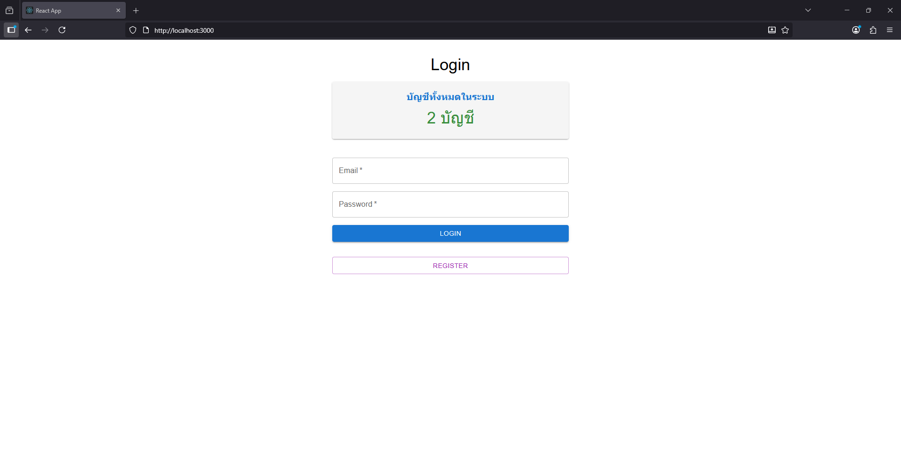
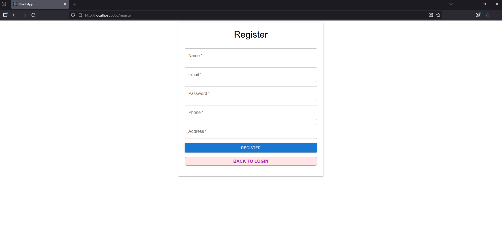
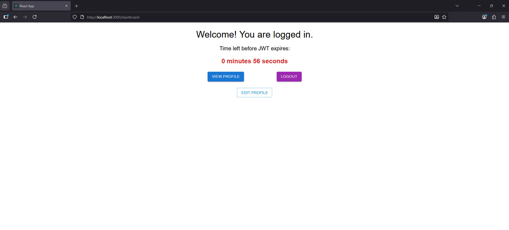
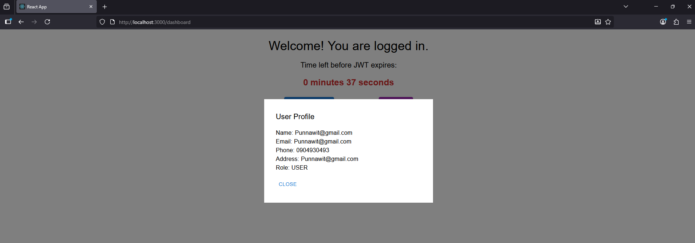
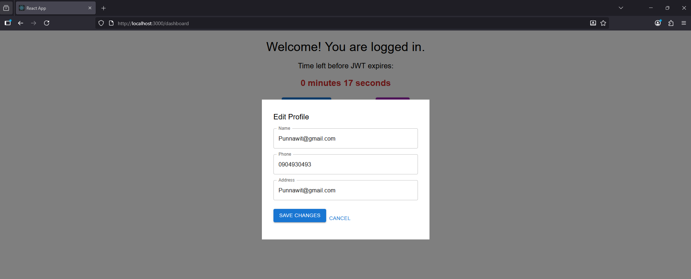
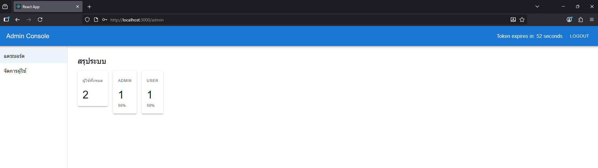
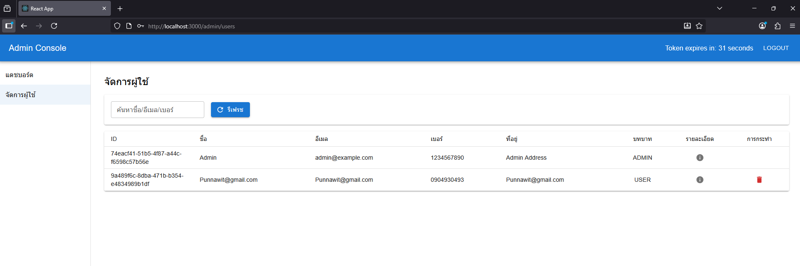

# Basic Authentication FullStack Project

โปรเจคนี้แสดงตัวอย่างการสร้างระบบการยืนยันตัวตน (Authentication) แบบ Full-Stack โดยใช้ Spring Boot สำหรับ Backend และ React สำหรับ Frontend

## เทคโนโลยีที่ใช้

**Backend:**
- Java 17 (JDK)
- Spring Boot v3.5.3
- IDE: IntelliJ IDEA

**Frontend:**
- React
- Node.js v22.18.0
- NPM v11.5.2
- IDE: VS Code

## วิธีการติดตั้ง

### การติดตั้ง Backend
1. Clone โปรเจค:
    ```bash
    git clone https://github.com/0xPunnawit/Project-Basic-Auth-FullStack.git
    ```
2. เข้าไปที่โฟลเดอร์ backend:
    ```bash
    cd backend
    ```

3. ตั้งค่า IntelliJ IDEA เพื่อเปิดใช้งาน Annotation Processing:
   - เปิด IntelliJ IDEA แล้วไปที่ **File > Settings** (หรือ **Ctrl + Alt + S**).
   - ไปที่ **Build, Execution, Deployment > Compiler > Annotation Processors**.
   - ตั้งค่า **Enable annotation processing** และเลือก **Obtain processors from project classpath**.
   
   ดูตัวอย่างการตั้งค่าจากรูปนี้: [Link รูป](https://media.discordapp.net/attachments/1359450746810011680/1409579968559579259/content.png?ex=68ade525&is=68ac93a5&hm=04e70cd1d4997320f3f1cc1ef4143fb940fc99a2c35fcdc06447f47b467588ee&=&format=webp&quality=lossless)

4. รันโปรเจคโดยไปที่ `Backend/src/main/java/com/punnawit/auth/AuthApplication.java` แล้วคลิก **Run**.

### การติดตั้ง Frontend
1. เข้าไปที่โฟลเดอร์ frontend:
    ```bash
    cd frontend
    ```
2. ติดตั้ง dependencies:
    ```bash
    npm install
    ```
3. รัน React Development Server:
    ```bash
    npm start
    ```

## Environment Variables
- `REACT_APP_BACKEND_URL` = URL ของ backend ที่ใช้เชื่อมต่อกับ React (เช่น `localhost:8080`).

## วิธีการใช้งาน
- เมื่อทั้ง backend และ frontend ตั้งค่าเรียบร้อยแล้ว คุณสามารถเข้าถึงโปรเจคได้ที่:
  - Backend URL: `http://localhost:8080`
  - Frontend URL: `http://localhost:3000`

## การใช้งาน JWT
- ระบบใช้ **JWT (JSON Web Token)** ในการยืนยันตัวตนของผู้ใช้งานหลังจากการ login
- หลังจากที่ผู้ใช้ล็อกอินสำเร็จ ระบบจะส่ง JWT token ไปยัง frontend
- ผู้ใช้สามารถใช้ token นี้ในการเข้าถึงข้อมูลที่ต้องการผ่าน API ที่มีการป้องกัน

**ตัวอย่างการเข้าสู่ระบบ (Login):**
- เมื่อผู้ใช้ login ด้วย **email** และ **password** ที่ถูกต้อง, ระบบจะส่ง JWT token ให้
- ใช้ token นี้ในการเข้าถึงส่วนต่าง ๆ ของโปรเจค เช่น การดึงข้อมูลผู้ใช้ หรือการแก้ไขข้อมูล

### ข้อมูลบัญชีผู้ใช้งาน (Admin)
- สำหรับการทดสอบระบบ คุณสามารถใช้บัญชี **admin** ที่มีข้อมูลดังนี้:
    - **Email**: `admin@example.com`
    - **Password**: `admin123`
    
### การ Login
ภาพตัวอย่างการ Login:


### การ Register
ภาพตัวอย่างการ Register:


### การ Login สำเร็จ
ภาพตัวอย่างการ Login สำเร็จ:


### การแสดงข้อมูล
ภาพตัวอย่างการแสดงข้อมูล:


### การแก้ไขข้อมูล
ภาพตัวอย่างการแก้ไขข้อมูล:


### ระบบแอดมิน
ภาพตัวอย่างระบบแอดมิน:


### การจัดการผู้ใช้
ภาพตัวอย่างการจัดการผู้ใช้:

